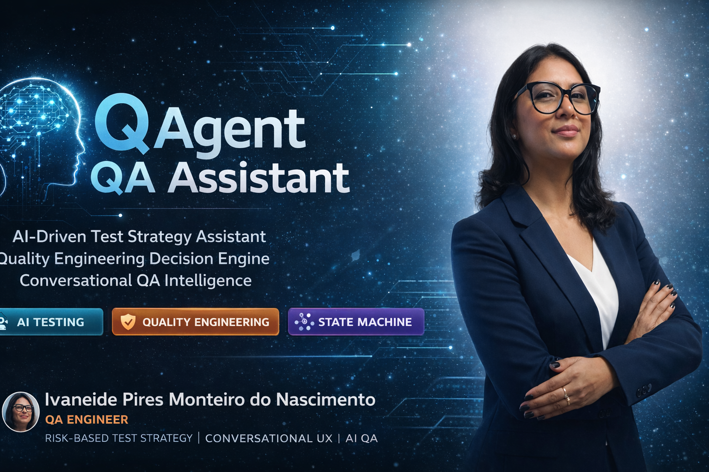

<p align="center">
  
</p>

<h1 align="center">🧠 QAgent QA Assistant</h1>

<p align="center">
AI-Driven Test Strategy Assistant · Quality Engineering Decision Engine · Conversational QA Intelligence
</p>

<p align="center">
  
  
  
  
  
</p>

---

## 🎯 Project Purpose

QAgent QA Assistant is an experimental intelligent system designed to support software quality decision-making.

The assistant receives a development task and helps QA professionals:

- identify delivery risk
- define validation strategy
- prioritize testing scope
- determine necessary evidence
- anticipate regression impact

This initiative explores the evolution from **test execution mindset → quality engineering mindset**.

---

## 🧠 AI-Driven Quality Engineering Concept

The assistant simulates senior-level reasoning by applying structured rules combined with behavioral modeling.

Core principles:

- Risk-based validation
- Conversational UX testing awareness
- Integration impact detection
- Evidence-oriented testing
- Regression intelligence

The project represents an early step toward **AI copilots for Quality Engineering**.

---

## ⚙️ MVP Architecture

```text
qagent-qa-assistant/
│
├── package.json
└── src/
    ├── index.js
    ├── machine/
    │   └── qaAssistantMachine.js
    ├── rules/
    │   └── recommendationEngine.js
    └── data/
        └── testCatalog.js

## 🔄 Decision Flow Architecture

```mermaid
stateDiagram-v2
    [*] --> Idle

    Idle --> TaskAnalysis : start
    TaskAnalysis --> ImpactAssessment : classify change
    ImpactAssessment --> RiskCalculation : evaluate signals
    RiskCalculation --> TestStrategy : generate recommendations
    TestStrategy --> EvidencePlanning
    EvidencePlanning --> RegressionDecision
    RegressionDecision --> [*]
````

---

## 🚨 Risk Classification Logic

Risk level is estimated based on:

* presence of new functional flows
* external integrations
* file uploads
* protocol persistence
* conversational journey impact

| Score | Risk   |
| ----- | ------ |
| 0-3   | Low    |
| 4-6   | Medium |
| 7+    | High   |

---

## 🧪 Testing Strategy Dimensions

The assistant currently suggests validation across:

* Upload validation scenarios
* API integration testing
* Conversational flow consistency
* Protocol generation verification
* Regression impact coverage

---

## 📸 Evidence-Driven Validation

Suggested evidence types:

* UI interaction screenshots
* API logs and payload analysis
* conversational transcripts
* persistence confirmation
* final user message validation

This reinforces a **quality assurance culture based on traceability and observability**.

---

## ▶️ How to Run

```bash
npm install
node src/index.js
```

---

## 🏗️ Product Architecture Vision

Future evolution may include:

* WhatsApp / Teams conversational bot
* Jira integration for task ingestion
* automatic test plan generation
* predictive risk analytics
* CI/CD pipeline advisory
* automation orchestration assistant
* quality intelligence dashboard

---

## 👩‍💻 QA Strategy Leadership

<p align="center">
  
</p>

### Ivaneide Pires Monteiro do Nascimento

QA Engineer · Quality Strategy · AI-Driven Testing · Risk-Based Validation

Professional focused on evolving software quality beyond traditional testing execution, working on:

* cognitive testing approaches
* decision intelligence for QA
* conversational UX validation
* strategic regression design
* quality engineering mindset adoption

This project reflects an initiative to transform tacit testing expertise into scalable intelligent systems.

---

## 🚀 Innovation Vision

QAgent explores the transformation of QA knowledge into:

* structured decision engines
* behavioral quality models
* intelligent testing copilots
* scalable validation frameworks

The long-term vision aligns with the emergence of **AI-augmented Quality Engineering practices**.